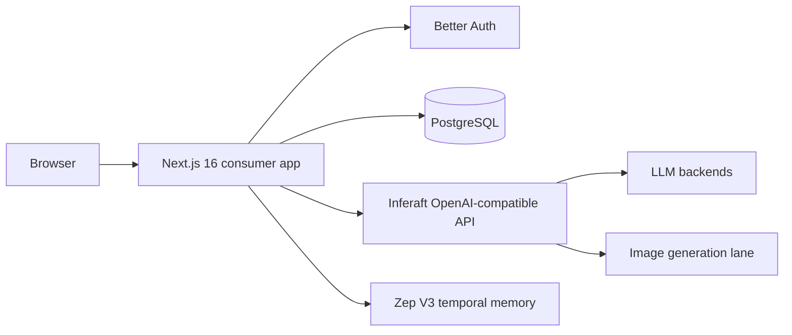

# Architecture

## Ownership

### Storydeck owns
- public character discovery and consumer UX
- character cards, personas and lorebooks
- conversation transcript and branches/swipes
- narrative summaries and explicit memory notes
- creator/community metadata
- moderation policy and consumer entitlements

### Inferaft owns
- model catalog and routing
- inference authentication
- request admission/concurrency
- usage and provider cost controls
- image generation execution/storage contract
- provider abstraction

### Zep owns
- temporal semantic memory extraction/retrieval
- user/thread knowledge graph

PostgreSQL remains canonical. Zep can be rebuilt from conversation history; lorebooks must never depend on Zep retrieval to function.
